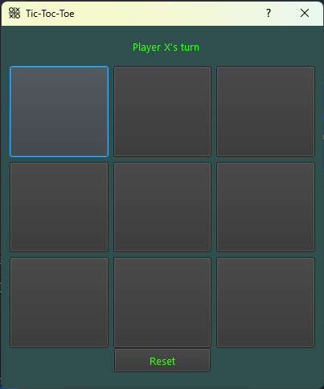

# Tic-Tac-Toe Game with PyQt5


## Description

The **Tic-Tac-Toe Game with PyQt5** is a desktop application developed using Python and PyQt5. This game features a modern dark theme with neon accents, allowing players to engage in a classic Tic-Tac-Toe game with a stylish and interactive graphical user interface. Players can take turns to place their marks on a 3x3 grid, and the game will automatically check for winners or a draw. The application also includes a reset button to start a new game.

## Features

- **Play Tic-Tac-Toe**: Engage in a classic game of Tic-Tac-Toe with a user-friendly interface.
- **Player Turns**: Switch between Player X and Player O.
- **Win Detection**: Automatically detect and announce when a player wins.
- **Draw Detection**: Announce a draw when all cells are filled without a winner.
- **Reset Game**: Reset the game board to start a new game.
- **Modern Dark Theme**: Enjoy a visually appealing dark theme with neon accents.

## Screenshots

Here are some screenshots of the Tic-Tac-Toe game:

1. **Game Window:**
---
   


## Installation

1. **Clone the Repository:**

   ```bash
   git clone https://github.com/Hamed-Gharghi/Tic-Tac-Toe.git
   ```

2. **Navigate to the Project Directory:**

   ```bash
   cd Tic-Tac-Toe
   ```

3. **Install the Required Python Packages:**

   ```bash
   pip install PyQt5
   ```

4. **Run the Application:**

   ```bash
   python Tic_Toc_Toe.py
   ```

## Files

- **`Tic_Toc_Toe.py`**: The main Python script that contains the game logic and UI.
- **`Tic_Toc_Toe.ui`**: The Qt Designer file for the application's interface layout.
- **`icon.png`**: Icon used for the application window.
- **`README.md`**: This README file.

## Usage

- **Play the Game**: Click on the buttons in the 3x3 grid to place your mark.
- **Check Status**: The status label will update to show whose turn it is or if the game has been won or drawn.
- **Reset Game**: Click the "Reset" button to restart the game.

## License

This project is licensed under the MIT License - see the [LICENSE](LICENSE) file for details.

## Tags

- **Python**: Python
- **PyQt5**: PyQt5, Qt
- **GUI**: Graphical User Interface
- **Tic-Tac-Toe**: Tic-Tac-Toe Game, Classic Game
- **Desktop Application**: Desktop App, Desktop Software
- **Open Source**: Open Source, MIT License
- **Game Development**: Game Development, Game Programming
- **Productivity**: Casual Gaming, Entertainment

## Keywords

- Python PyQt5
- Tic-Tac-Toe Game
- Desktop Game Application
- Modern GUI Game
- Game Programming
- Open Source Game
- Interactive Game
- PyQt5 GUI

## Author

**Hamed Gharghi**

- Email: [Hamedgharghi1@gmail.com](mailto:Hamedgharghi1@gmail.com)
- GitHub: [Hamed-Gharghi](https://github.com/Hamed-Gharghi)

## Acknowledgements

- PyQt5 documentation for guidance on creating the GUI.
- Qt Designer for designing the UI layout.
- Contributions and feedback from the open-source community.

